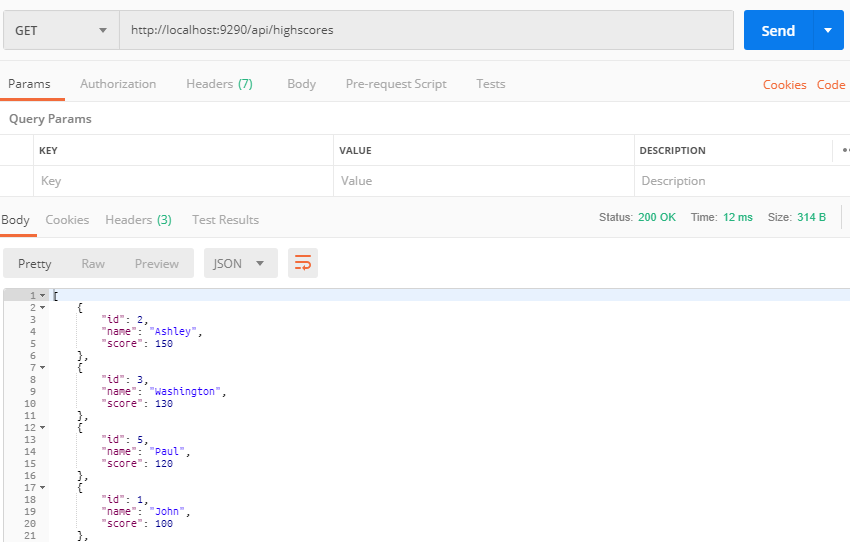

# highscore-entries

Spring Boot RESTful application created with Hibernate and Jetty embedded to distribute APIs to do CRUD operations on Highscores.

#### Available APIS:

GET: /api/highscores

  

GET: /api/highscores/{id}

  

POST: /api/highscores - Params -> name, score

  

POST: /api/highscores - Params -> id, name, score

  

DELETE: /api/highscores/{id}

